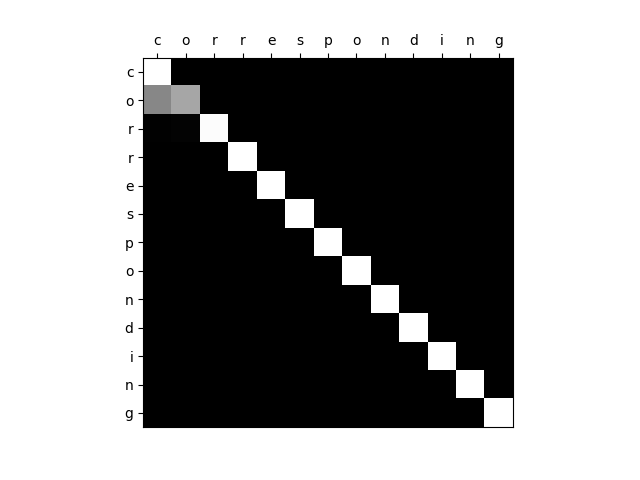

# Encoder-Decoder models
In this project, the following models are implemented: 
* [Seq2Seq](https://papers.nips.cc/paper/5346-sequence-to-sequence-learning-with-neural-networks.pdf)
* [Attention mechanism](https://arxiv.org/abs/1508.04025)
* [Copy mechanism](https://arxiv.org/abs/1603.06393) 

## Requirements
* Python 3.6
* Tensorflow 1.8

## usage
```angular2html
python run.py --model=BasicSeq2Seq
python run.py --model=AttenNet
python run.py --model=CopyNet
```
## Experiment
I build a toy task: word reconstruction.  e.g.  ‘cambridge’ → Encoder → Decoder → ‘cambridge’  
Training data : ~20k English words   
Testing data : 1K English words    
Vocabulary : ‘a’,’b’,...’w’,’\<EOS>’,’\<BOS>’,’\<UNK>’  
OOV tokens: ‘x’,’y’,’z’. 

### Results
After around 1 epoch traning, the results are:   

| Model | Accu |
| :---: | :---:|  
| Seq2Seq | 0.9544 | 
| Attention | 0.9966 | 
| Copy | 1.0000| 

### Test samples
These samples are tested :   
'circumstances', 'affirmative', 'corresponding', 'caraphernology','experimentation', 'dizziness','harambelover', 'terrifyingly','axbycydxexfyzxx'

#### Seq2Seq
```angular2html
true output: c i r c u m s t a n c e s 
pred output: c i m p h p s t a n s e s 

true output: a f f i r m a t i v e 
pred output: a p h i m m a t i s e 

true output: c o r r e s p o n d i n g 
pred output: c o r s r s p o n g i n g 

true output: c a r a p h e r n o l o g <UNK>
pred output: c a m u p p e r o o r e n e

true output: e <UNK> p e r i m e n t a t i o n
pred output: e r     p e r i s e t t a s i o n

true output: d i <UNK> <UNK> i n e s s
pred output: d i r     r     i n e s s

true output: h a r a m b e l o v e r
pred output: m a m a b b l m u t e s

true output: t e r r i f <UNK> i n g l <UNK>
pred output: t e r p l p  e    i n e l <UNK>

true output: a <UNK> b <UNK> c <UNK> d <UNK> e <UNK> f <UNK> <UNK> <UNK> <UNK>     
pred output: a   m   b   r   s <UNK> r <UNK> r  r    p  e    r      r      l 
```
#### Attention
```angular2html
true output: c i r c u m s t a n c e s 
pred output: c o r c u m s t a n c s s
true output: a f f i r m a t i v e 
pred output: a f f i r m a t i v e 
true output: c o r r e s p o n d i n g 
pred output: c o r r e s p o n d i n g
true output: c a r a p h e r n o l o g <UNK> 
pred output: c o e h p h e r n o l o g <UNK> 
true output: e <UNK> p e r i m e n t a t i o n 
pred output: e e     p e a e m e n t a t i o n
true output: d i <UNK> <UNK> i n e s s 
pred output: d i <UNK> <UNK> i n e s s 
true output: h a r a m b e l o v e r 
pred output: h a r a m b e l o v e r
true output: t e r r i f <UNK> i n g l <UNK>
pred output: t e r r i f <UNK> i n g l <UNK>
true output: a <UNK>   b   <UNK>   c  <UNK> d <UNK> e <UNK> f <UNK> <UNK> <UNK> <UNK> 
pred output: c <UNK> <UNK> <UNK> <UNK> d    d <UNK> e <UNK> f <UNK> <UNK> <UNK> <UNK> 
```



#### CopyNet
```angular2html
true output: c i r c u m s t a n c e s 
pred output: c i r c u m s t a n c e s

true output: a f f i r m a t i v e 
pred output: a f f i r m a t i v e 

true output: c o r r e s p o n d i n g 
pred output: c o r r e s p o n d i n g 

true output: c a r a p h e r n o l o g y
pred output: c a r a p h e r n o l o g y

true output: e x p e r i m e n t a t i o n 
pred output: e x p e r i m e n t a t i o n 

true output: d i z z i n e s s 
pred output: d i z z i n e s s 

true output: h a r a m b e l o v e r
pred output: h a r a m b e l o v e r

true output: t e r r i f y i n g l y 
pred output: t e r r i f y i n g l y 

true output: a x b y c y d x e x f y z x x y 
pred output: a x b y c y d x e y d y z x x y
```
Almost 100% correct
